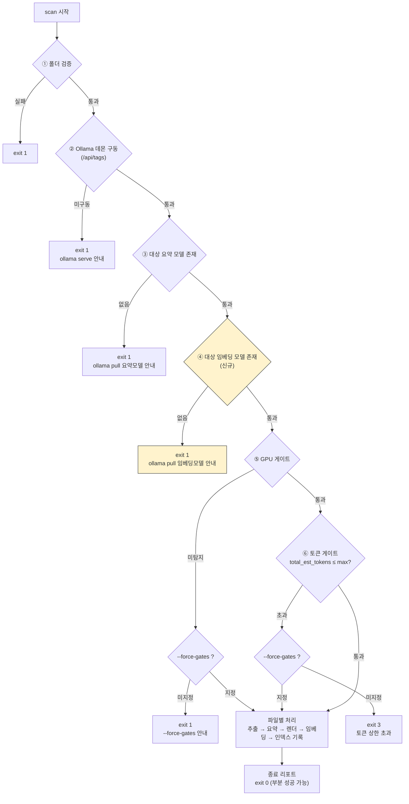

# 스펙: CorpBrain v0.4 — 벡터 인덱싱 + 검색

- 상태: 확정
- 최종 갱신: 2026-08-19

## 1. 목표
v0.3까지 완성된 로컬 스캔→요약→마크다운 위키 파이프라인에 벡터 기반 검색을 추가한다. `scan`이 위키를 생성할 때 각 문서를 로컬 Ollama 임베딩 모델로 벡터화해 로컬 인덱스에 저장하고, 신규 `corpbrain search` 명령으로 자연어 쿼리에 대해 유사도 상위 문서를 찾을 수 있게 한다. 검색된 문서를 근거로 LLM이 답변을 합성하는 "RAG의 답변 생성" 단계는 이번 슬라이스에 포함하지 않는다 — 인덱싱과 검색까지만이다. 외부로 나가는 통신은 v0.3과 동일하게 로컬 Ollama 호출 외 전무하다. [사용자 결정]

## 2. 비목표
이번 슬라이스에서 다음은 하지 않는다. [사용자 결정]
- RAG 답변 생성(검색 결과를 근거로 LLM이 자연어 답변을 합성하는 단계) — 다음 슬라이스로 이월.
- 문서 내 청크 분할(chunking) — 문서당 벡터 1개로 고정.
- 임베딩 모델 자동 설치·자동 pull — 기존 Ollama 연동과 동일하게 진단·안내만 한다.
- 클라우드/외부 임베딩 API.
- 벡터 저장소의 원격·분산·다중 사용자 동시접근 — 단일 로컬 파일·단일 프로세스를 가정한다.
- 인덱스 스키마 마이그레이션 — 손상되거나 구버전 스키마면 자동 복구하지 않고 에러 + `--force` 재생성 안내만 한다.
- GPU 가속 벡터 연산 — brute-force 코사인 유사도로 충분하다고 판단한다(스캔 상한 50 규모).

## 3. 완료의 정의
검증 방식(전반): 프리플라이트·게이트·증분 판정은 순수 코어 단위테스트로, 파이프라인·`search`·`doctor`는 Ollama HTTP를 mock으로 스텁한 통합테스트로 검증하고, 마무리로 실제 임베딩 모델 1회 수동 스모크를 실행한다.

1. `--embed-model`(기본 `nomic-embed-text`)이 대상 Ollama 인스턴스의 모델 목록에 없으면 `scan`은 파일을 처리하지 않고 **exit 1**로 종료하며 `ollama pull <embed-model>` 안내를 낸다. `--force-gates`로 우회되지 않는다.
   - 검증: 통합테스트(모델 목록 mock) — exit 코드·처리 0건·안내 문자열 확인.
2. 정상 실행 시, 신규 생성되거나 재생성된 위키 문서마다 임베딩이 계산되어 `<out_dir>` 하위 인덱스 파일에 저장된다.
   - 검증: 통합테스트 — 인덱스에 처리된 문서 수만큼 레코드 존재 확인.
3. mtime 비교로 위키가 스킵되더라도, 인덱스에 해당 문서 벡터가 없으면 새로 계산해 채워 넣는다. 인덱스에 이미 있으면 재계산하지 않는다. `--force`는 위키·인덱싱을 모두 강제 재계산한다.
   - 검증: 통합테스트 — 재실행 시 임베딩 API 호출 횟수(mock 호출 카운트)로 스킵/채움 동작 확인.
4. 프리플라이트(모델 존재 확인)를 통과한 뒤에도 특정 문서의 임베딩 API 호출이 런타임에 실패하면, 그 문서의 위키 `.md`는 그대로 유지하고 인덱싱만 신규 사유(`embedding_failed`)로 종료 리포트에 남긴다. 나머지 문서는 계속 처리되며 전체 종료 코드는 **exit 0**(부분 성공)이다.
   - 검증: 통합테스트 — 특정 파일에서만 임베딩 API가 실패하도록 mock, 그 파일의 위키 존재+인덱스 미존재+리포트 사유 확인, exit 0 확인.
5. 원문 또는 위키가 삭제된 뒤 재스캔하면, 인덱스에서 더 이상 대응하는 원문이 없는 벡터(고아 벡터)가 제거된다.
   - 검증: 통합테스트 — 파일 삭제 후 재스캔, 인덱스에 고아 레코드가 없음을 확인.
6. `corpbrain search <query> --out DIR`(기본값 `./corpbrain_wiki`):
   - `out` 디렉터리에 `.corpbrain_index.sqlite`가 없으면 **exit 1** + "먼저 scan을 실행하라" 안내.
   - 인덱스는 있으나 결과가 0건이면 **exit 0** + "일치하는 문서 없음" 메시지.
   - 결과가 있으면 코사인 유사도 기준 상위 `--top-k`(기본 5)개를 점수 내림차순으로(제목·경로·점수) 출력하고 **exit 0**.
   - 검증: 통합테스트 — 세 상황 각각의 exit 코드·출력 확인.
7. `search`는 쿼리 임베딩에 인덱스 메타데이터에 기록된 임베딩 모델을 강제로 사용한다(`search`에는 `--embed-model` 플래그가 없다).
   - 검증: 단위테스트 — 인덱스 메타데이터의 모델명이 쿼리 임베딩 호출에 그대로 쓰이는지 확인.
8. `corpbrain doctor`가 임베딩 모델(기본 `nomic-embed-text`) 존재 여부를 점검 항목에 추가한다(모델 없음 → **exit 1** + `ollama pull <embed-model>` 안내, 기존 요약 모델 점검과 동일한 패턴).
   - 검증: 통합테스트(모델 목록 mock) — 임베딩 모델 유무에 따른 exit 코드·안내 확인.
9. 임베딩 API 호출을 포함해 모든 네트워크 호출은 단일 관문(`gateway.request_json`)을 경유하며 localhost 외 연결이 0이다.
   - 검증: 기존 소켓 워처 보안 테스트를 임베딩 경로까지 포함하도록 확장해 확인.
10. 벡터 저장소는 어댑터 인터페이스 뒤에 있어, 이번 슬라이스의 구현체(외부 의존성 없는 자체 구현)를 다른 벡터 저장소 구현체로 교체할 수 있는 구조다.
    - 검증: 코드 리뷰 — 파이프라인·`search`가 구체 구현이 아닌 인터페이스 타입에 의존하는지 확인 + 인터페이스 계약 단위테스트.
11. 하위 호환: 신규 `--embed-model` 플래그 없이 기존처럼 `scan`을 실행해도 되지만, 임베딩 모델이 로컬에 없으면 이제 `scan` 자체가 실패한다 — 이는 v0.3의 GPU 게이트에 이은 **의도된 BREAKING 변경**이며 `docs/USAGE.md`의 v0.4 섹션과 GitHub Release(tag `v0.4`) 노트에 명시한다. `ruff check .`·`pytest`가 모두 통과한다.
    - 검증: 회귀 테스트 + `ruff check .` + `pytest`.
12. `total_est_tokens`(토큰 게이트 §4.2 ⑥의 판정 대상) 산정에 임베딩 비용 추정치를 포함한다 — 문서별 원문 추정 토큰 × 10%를 임베딩 토큰 추정치로 더한다. `--max-total-tokens` 게이트는 이 합산값을 기준으로 판정한다.
    - 검증: 단위테스트 — 원문 추정 토큰과 최종 `total_est_tokens`의 차이가 정확히 10% 가산분과 일치하는지 확인. 통합테스트 — 가산분 포함 시에만 임계를 넘도록 조정한 픽스처로 exit 3 발동 확인.

## 4. 인터페이스 계약

### 4.1 CLI
```
corpbrain scan <folder>
  ... (v0.3 인자 유지: --out, --model, --max, --max-chars, --ollama-url, --force,
       --force-gates, --max-file-size, --max-total-tokens) ...
  --embed-model NAME     기본 nomic-embed-text (환경변수 CORPBRAIN_EMBED_MODEL로도 지정)
  # 인덱싱 on/off 플래그 없음 — scan은 항상 인덱싱까지 수행한다.

corpbrain search <query>
  --out DIR                기본 ./corpbrain_wiki (scan --out과 동일 관례)
  --top-k N                기본 5
  --ollama-url URL         기본 http://127.0.0.1:11434
  # --embed-model 없음 — 인덱스에 기록된 임베딩 모델을 강제 사용한다.

corpbrain doctor
  --model NAME            점검할 요약 모델 (기존 유지)
  --embed-model NAME      점검할 임베딩 모델, 기본 nomic-embed-text (신규)
  --ollama-url URL        기본 http://127.0.0.1:11434
```
- `search`의 종료 코드: `0`(정상 — 결과 있거나 0건 모두 포함) / `1`(선행조건 실패 — 인덱스 파일 없음, Ollama·임베딩 모델 미비).
- 출력 언어: 한국어(기존 원칙 계승). [사용자 결정]

### 4.2 scan 프리플라이트 순서 (fail-fast, v0.3 순서에 편입)



①~④(폴더·Ollama·요약모델·임베딩모델)는 `--force-gates`로 우회 불가. ⑤⑥(GPU·토큰)만 우회 가능. [사용자 결정]

### 4.3 임베딩·벡터 연동
- 백엔드: 로컬 Ollama, 기존 단일 관문(`gateway.request_json`)을 그대로 재사용한다. 신규 네트워크 클라이언트 함수만 추가한다. [사용자 결정]
- 임베딩 단위: 문서당 벡터 1개. 입력은 렌더링된 위키 마크다운의 요약 콘텐츠(제목·한줄요약·핵심포인트·요약·태그)를 합친 텍스트다. 청크 분할은 하지 않는다. [사용자 결정]
- 벡터 저장소: 외부 의존성 없는 자체 구현(표준 라이브러리 `sqlite3` 기반, 코사인 유사도는 순수 파이썬으로 계산)으로 시작하고, 어댑터 인터페이스 뒤에 두어 향후 `sqlite-vec`나 `chromadb` 같은 구현체로 교체할 수 있게 한다. 이번 슬라이스는 신규 외부 패키지를 `pyproject.toml`에 추가하지 않는다. [사용자 결정]
- 인덱스 파일은 `<out_dir>/.corpbrain_index.sqlite`에 저장한다(위키 산출물과 생명주기를 함께함). 점(`.`) 접두 숨김 파일로 두어 위키 `.md` 산출물과 섞여도 사용자가 실수로 열거나 지울 위험을 줄인다. 인덱스에는 사용된 임베딩 모델명을 메타데이터로 기록한다. [사용자 결정]
- **어댑터 인터페이스 계약(최소 계약)**: `upsert(doc_id: str, vector: list[float], metadata: dict) -> None`, `delete(doc_id: str) -> None`, `search(query_vector: list[float], top_k: int) -> list[SearchResult]`, `model_name: str`(인덱스가 기록한 임베딩 모델명 접근자) — 이번 슬라이스가 필요로 하는 연산과 1:1로 대응하는 3메서드 + 속성 하나로 구성한다. 파이프라인·`search` CLI는 이 인터페이스 타입에만 의존하고 구체 구현(`sqlite3` 기반)을 직접 참조하지 않는다. [사용자 결정]
- **임베딩 실패 표현**: 신규 frozen dataclass `EmbeddingFailure`(필드: 경로·사유)를 추가하고 `ScanResult`에 `embedding_failures: list[EmbeddingFailure]` 필드를 둔다. 기존 `SkippedFile`(산출물 자체가 없는 경우)과 의미가 다르므로 재사용하지 않고 별도 리스트로 관리하며, 종료 리포트에서 "스킵"과 분리된 "인덱싱 실패" 섹션으로 표시한다. [사용자 결정]
- **토큰 게이트 산정 확장**: `plan_scan`이 계산하는 `total_est_tokens`(§4.2 ⑥ 토큰 게이트의 판정 대상)에 임베딩 비용 추정치를 포함한다. pre-scan 시점엔 위키 요약 결과가 아직 없어 실제 임베딩 입력 길이를 알 수 없으므로, 문서별 **원문 추정 토큰 × 10%**를 임베딩 토큰 추정치로 근사해 가산한다. 이 산정은 여전히 순수 로컬 계산이며 네트워크를 열지 않는다(v0.2/v0.3 pre-scan 원칙 유지). [사용자 결정]
- 증분 규칙: 위키가 재생성되면 벡터도 항상 재계산한다. 위키가 스킵되더라도 인덱스에 해당 문서 벡터가 없으면 채워 넣고, 있으면 재계산하지 않는다. `--force`는 위키·인덱싱을 모두 강제 재계산한다. [사용자 결정]
- 원문 또는 위키가 삭제되면 다음 `scan` 실행 시 인덱스에서 대응 벡터를 제거한다(고아 벡터 없음). [사용자 결정]
- 프리플라이트 통과 후 개별 문서의 임베딩 호출이 런타임 실패하면 그 문서의 인덱싱만 `embedding_failed` 사유로 리포트에 남기고 위키는 유지한다. [제안 후 승인]

### 4.4 구조 제약 (기존 이음새 계승)
- 모든 임베딩 API 호출은 단일 관문을 경유한다. 네트워크-순수 원칙(예: `shutil`/`subprocess`/`os` 미import)을 임베딩 클라이언트 모듈에도 동일하게 적용한다. [파생]
- `plan`/`scan --dry-run`은 네트워크 0을 유지한다 — 임베딩 모델 선점검은 `scan`/`doctor`에서만 한다(v0.3에서 확립한 원칙 계승). [기존 불변식 계승]
- `scan`/`search` 실패 메시지는 `doctor`와 같은 진단 코어를 재사용한다(v0.3 패턴 계승). [파생]

## 5. 엣지 케이스와 실패 시나리오
- 임베딩 모델 미설치: `scan`은 exit 1 + 안내, `--force-gates` 무관. `doctor`도 동일하게 감지.
- 프리플라이트 통과 후 특정 문서의 임베딩 호출만 런타임 실패: 위키는 유지, 인덱싱만 `embedding_failed`로 리포트, 나머지 계속 처리, exit 0.
- 위키는 스킵되지만 인덱스 벡터가 없는 문서(예: v0.3 위키 폴더에 처음 v0.4를 적용하는 경우): 인덱싱을 수행해 채워 넣는다.
- 원문/위키 삭제: 다음 `scan`에서 고아 벡터를 정리한다.
- `search` 대상 인덱스 파일이 없음: exit 1 + 안내.
- `search` 결과 0건(인덱스는 정상): exit 0 + 안내 메시지.
- `search`에 인덱스 생성 시와 다른 임베딩 모델을 쓰려는 시도: 플래그 자체가 없어 발생하지 않는다.
- 유사도 임계값 미적용: top-K 안에 낮은 점수의 문서도 노출될 수 있다 — 사용자가 점수를 보고 판단한다.
- 인덱스 파일 손상·구버전 스키마: 자동 마이그레이션하지 않고 에러 + `--force` 재생성 안내(정확한 메시지 문구는 구현 시 결정).

## 미결정 사항
없음
